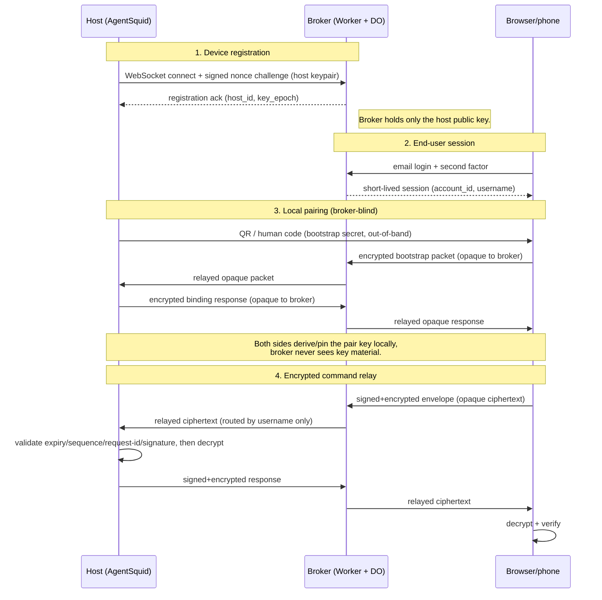

# ADR-0039: Remote access via a Cloudflare Workers + Durable Objects broker (agentsquid.ai/@username)

## Context

AgentSquid runs a local web server (shell command execution, dashboard) on
loopback on a user's always-on machine (e.g. a home server). We want a phone
to reach that local server securely, with zero client install on the phone,
and with the whole thing working "out of the box" after `agentsquid login` —
no VPN app, no manual DNS setup, no per-user domain.

Because this grants remote shell-command execution, the security bar for
this design should be treated as equivalent to SSH or remote-desktop access,
not a typical web-app login.

### Options considered

1. **Tailscale (or Headscale) mesh** — every device, including the phone,
   needs the Tailscale client installed. Rejected: violates the zero-install
   requirement for the phone, and gives us full mesh networking we don't
   need for a client-reads-from-one-server use case. Notably, WireGuard-based
   tunnels (Tailscale included) are end-to-end encrypted between devices —
   the coordination/relay servers never see tunnel content, only metadata.
   That property is not automatic in the design below and has to be
   deliberately rebuilt (see Security section).

2. **Tailscale Funnel** — exposes the local server via a public HTTPS URL
   without phone-side install, reusing the Tailscale node already useful for
   other things. Rejected for this use case: still requires the *host*
   machine to run Tailscale, ties remote access to a Tailscale account, and
   provides no built-in application-level auth (Funnel just makes the port
   public — we would still have to build auth ourselves, at which point the
   Tailscale dependency buys us little over the Cloudflare option below).

3. **Cloudflare Tunnel with one subdomain per user**
   (`username.agentsquid.ai`) — `cloudflared` runs on the host machine,
   phone hits a plain HTTPS URL, no phone-side install. Rejected as the
   long-term design: each user needs a dedicated Cloudflare Tunnel and DNS
   record, and Cloudflare's free plan caps DNS records per zone at 200 for
   zones created on or after September 1, 2024 (1,000 for older zones; 3,500
   on Pro/Business/Enterprise). This caps free-tier growth at roughly 200
   users and requires a paid Cloudflare plan beyond that.

4. **Cloudflare Access for authentication** — turnkey login screen (email
   OTP, OAuth) gating a Tunnel hostname. Rejected as the primary auth
   mechanism: free plan covers only 50 users (a seat is consumed per
   authentication event and held until removed), $7/user/month after that.
   Using Access for every user ties our per-user cost directly to Cloudflare
   pricing rather than to our own infrastructure.

5. **Self-hosted relay (frp / ngrok-style broker)** — one server we run,
   users' AgentSquid instances dial out to it, it multiplexes by hostname or
   path. Solves the DNS-record-limit problem but makes us the operator of
   always-on relay infrastructure: an outage takes down remote access for
   every user, and we own patching, scaling, and abuse prevention for a
   public network service.

6. **A dedicated `shore.agentsquid.ai` subdomain for the broker** — kept the
   Worker's routes cleanly separate from the GitHub-Pages-hosted marketing
   site on the apex domain, at the cost of a longer URL for users to type
   and remember. Rejected in favor of option 7: the same separation is
   achievable on the apex domain itself via a path-scoped Worker route, at
   no cost to security or architecture, while giving users a shorter URL.

7. **Cloudflare Workers + Durable Objects broker on `agentsquid.ai`
   directly** (chosen) — see Decision.

## Decision

Build the remote-access broker as a single Cloudflare Worker, backed by one
Durable Object per immutable account ID, reachable at
`agentsquid.ai/@<username>`.

Implementation sequencing, acceptance gates, and verification are maintained
in the [ADR-0039 Shore implementation plan](../plans/adr-0039-shore-remote-access.md).
This ADR remains the authority for architecture and security decisions; the
plan must not weaken or silently replace them.

The broker carries the versioned real-time application protocol defined by
ADR-0040. Implement and validate that protocol locally before making the broker
its remote transport; Shore must not define a second set of chat, lifecycle,
reconnect, or replay semantics.

The accepted implementation contract is split into these normative documents:

- [Shore protocol v1](../shore-protocol-v1.md), including algorithms,
  serialization, envelope validation, capability registry, pairing, recovery
  verifier, and [test vectors](../shore-protocol-v1-vectors.json);
- [Shore identity and lifecycle state machines](../shore-state-machines.md);
- [Shore security, privacy, operations, threat model, and Cloudflare
  revalidation](../shore-security-operations.md).

Changes to those contracts require an ADR amendment and new vectors; an
implementation must not silently choose different security semantics.

The 2026-09-03 amendment resolves pairing bootstrapping: the browser's initial
closed-schema packet is encrypted under the protocol-defined bootstrap HKDF
key, while the mutually verified host response uses the binding-derived pair
key. This preserves broker blindness without requiring either side to know the
encrypted browser-key fingerprints before decrypting them.

The 2026-09-03 transport amendment defines a zero-length, host-only binary
lease heartbeat. The broker consumes this transport control without relaying
it, applies ordinary socket rate limits and revocation checks, and accepts no
browser-originated equivalent. All non-heartbeat payload frames remain opaque
encrypted Shore envelopes.

### Coexisting with the existing GitHub-Pages-hosted site

`agentsquid.ai` already serves the project's marketing/docs site via GitHub
Pages. Rather than route the broker through a separate subdomain, scope the
Worker to a **path pattern**, e.g. a Cloudflare Workers Route of
`agentsquid.ai/@*`. Only requests matching `/@username` are intercepted by
the Worker; everything else continues to be served by GitHub Pages
untouched. This keeps the two systems decoupled operationally (no shared
deploy, no risk of one's routing rules swallowing the other's paths) while
giving users the shorter, single-domain URL.

### Architecture

- **No new DNS record for the broker itself** — it rides on the existing
  `agentsquid.ai` zone via a path-scoped Worker route, not a new hostname.
- **One Durable Object per user**, addressed via `idFromName(account_id)`.
  A separate singleton
  identity-index Durable Object maps normalized email addresses to immutable
  account IDs and current usernames, and serializes uniqueness checks,
  signup, recovery, and username changes. Per-user objects remain the source
  of truth for account and device state.
- **Exactly one current host per account.** Shore is a free service and does
  not provide multi-host routing. The first installation receives an immutable
  random `host_id`, its own key pair, and device/capability state inside the
  account object; `agentsquid.ai/@<username>` always addresses that host. The
  account object rejects registration of a second current host. Reinstallation
  with the existing private key is a reconnect, while a lost-key replacement
  must follow the recovery rules below, revoke the old host, and create a new
  immutable `host_id`. Revoked host identities remain in audit history and do
  not count as current hosts.
- **No `cloudflared` binary and no Cloudflare Tunnel resource.** The account's
  current AgentSquid installation opens an outbound WebSocket to the Worker
  (`wss://agentsquid.ai/@<username>/register`, or an equivalent registration
  path) and the owning Durable Object holds that connection, using WebSocket
  hibernation so an idle connection costs near-zero compute.
- **Request flow**: a request to `agentsquid.ai/@<username>` hits the
  Worker, which obtains the immutable account ID from the validated session,
  confirms that its username binding matches the route, addresses that user's
  Durable Object, forwards the request down the held WebSocket to the user's
  local AgentSquid instance, and relays the response back. Unauthenticated
  login/recovery lookup may consult the identity index before a session exists.
- **Username resolution must not invoke the identity-index Durable Object on
  every dashboard request.** After authentication, a signed session carries
  the immutable account ID and current username; the Worker validates that
  binding and addresses the account object directly. The identity index is
  used for signup, login lookup, rename, and recovery, not as a per-request
  forwarding hop. Otherwise ordinary HTTP traffic would consume at least two
  Durable Object requests per operation and roughly halve the capacity
  forecasts below.
- Runs entirely on Cloudflare's free tier at expected early-stage volume
  (Workers Free: ~100K requests/day; Durable Objects on Workers Free:
  ~100K requests/day and ~13K GB-seconds/day). No paid Cloudflare plan
  required to launch.
- **Status/health updates are pushed over the WebSocket, not polled via
  HTTP.** The Workers Free request quota (~100K/day) is consumed by every
  request through the Worker, not just login/registration — a naive client
  polling for status every few seconds would burn through a large share of
  that daily budget from a single active session alone. The phone holds its
  own WebSocket connection to the Durable Object (the same pattern already
  used for the host machine's connection), and AgentSquid pushes
  status/output events down it only when state actually changes, rather
  than the phone re-requesting on an interval. WebSocket messages are
  billed at a 20:1 ratio against the separate Durable Objects quota, not
  1:1 against the Workers request limit. This also solves a second,
  independent problem: without push, a change made from one device (e.g.
  starting a job on desktop) wouldn't appear on another (e.g. the phone)
  without a manual refresh. Push-based sync makes multi-device state
  consistency (desktop and phone reflecting the same running state without
  polling) a byproduct of the same mechanism, rather than a separate
  feature to build — closer to how a chat app keeps devices in sync than to
  a traditional request/response API. Request and message volume in this
  design scales with connections, commands, and emitted state changes, not
  with polling frequency or total registered user count — idle accounts
  contribute negligible volume.

### System and protocol flow

The broker relays ciphertext it cannot read. It authenticates the account
session and the host connection, but the pair key used for command/response
encryption is established directly between host and browser during pairing
and never crosses the broker in a decryptable form.

### Traffic accounting and capacity forecast

The WebSocket migration removes repeated polling for live state; it does not
remove HTTP traffic. Files, topics, agents, stats, history, configuration,
uploads, diffs, and other bounded request/response operations remain HTTP by
design under ADR-0040. A remote HTTP operation that reaches Shore normally
consumes one inbound Worker request and one request to the account Durable
Object. Storage work inside the object is metered separately.

The initial Worker WebSocket upgrade counts as a request. Messages routed
through the Worker do not count as additional Worker requests. For Durable
Objects, establishing the connection counts as a request, outgoing WebSocket
messages are not charged as requests, and incoming WebSocket messages receive
a 20:1 request-billing ratio. These rules are pricing assumptions, not protocol
guarantees, and must be revalidated before launch and periodically afterward.

Static client assets must be served outside the `agentsquid.ai/@*` Worker route
through GitHub Pages or another static-assets path that does not invoke the
Worker. Worker cache hits still count as Worker requests. Remote data and
authenticated API responses must not be placed in shared public caches.

As of 2026-09-01, the relevant published allowances are:

| Resource | Free | Workers Paid standard |
| --- | --- | --- |
| Worker requests | 100,000/day; further invocations fail at the limit | 10M/month included, then $0.30/M |
| Durable Object requests | 100,000/day; operations fail at the limit | 1M/month included, then $0.15/M |
| Durable Object duration | 13,000 GB-s/day | 400,000 GB-s/month included, then usage pricing |

Workers Paid has a $5/month minimum. Paying does not create a fixed DAU cap:
usage continues with overage billing. The request prices are relatively small;
Durable Object duration can dominate cost if sockets do not hibernate or event
handlers remain active. Shore therefore requires the Durable Objects WebSocket
Hibernation API and must measure duration from the first deployment.

DAU forecasts use HTTP requests per active remote user per day. They assume
one account-object invocation per HTTP request, 30 days/month, static assets do
not invoke the Worker, and exclude abuse, storage operations, WebSocket
upgrades/messages, and operational headroom:

| Usage profile | HTTP requests/DAU/day | Free theoretical DAU | Free planning target (50% headroom) | DAU within paid 1M included DO requests/month |
| --- | ---: | ---: | ---: | ---: |
| Light | 50 | 2,000 | 1,000 | 666 |
| Normal | 150 | 666 | 330 | 222 |
| Heavy | 500 | 200 | 100 | 66 |

The paid included Durable Object allowance is lower than a full month of the
free daily allowance, but paid overages continue rather than failing at a daily
hard stop. At the normal 150-request assumption, approximate request-only cost
is:

| Sustained DAU | HTTP requests/month | Approximate monthly Worker + DO request cost |
| --- | ---: | ---: |
| 1,000 | 4.5M | $5.53 |
| 2,000 | 9M | $6.20 |
| 5,000 | 22.5M | $11.98 |
| 10,000 | 45M | $22.10 |

These figures include the $5 minimum but exclude duration, storage, email,
audit export, observability, taxes, and other services. They are planning
estimates, not a capacity commitment. Launch planning is 100–300 remote DAU on
Free, followed by a 500–1,000 DAU paid pilot. Forecasts must be replaced with
observed requests per DAU and duration per event after the first 100 active
users. Registered and idle accounts are not a useful capacity measure.

### Monitoring, quota protection, and degradation

Cloudflare's Workers and Durable Objects analytics are necessary but not
sufficient. Shore must export per-route Worker invocations, Durable Object
requests/duration/storage operations, WebSocket connections/messages and
reconnects, HTTP requests per page load and DAU, per-account/device usage,
rate-limit rejections, error rates, and projected quota-exhaustion time. The
Cloudflare dashboard and GraphQL Analytics API feed alerts; paid-plan budget
alerts are supplementary and are not treated as a real-time circuit breaker.

Apply both global and per-account/device/IP limits before an account Durable
Object is invoked. Use daily quota thresholds with tested operational actions:

- **50%:** informational alert and inspect route/request distribution.
- **70%:** operator warning; suppress optional refresh and prefetch work.
- **85%:** tighten abusive-client limits and disable expensive nonessential
  remote views while preserving security controls.
- **95%:** preserve login, pairing, revocation, existing WebSockets, and minimal
  read-only status; reject expensive operations with an explicit retry/fallback
  response.
- **100% or platform rejection:** show a clear Shore-unavailable state. Never
  silently retry in a way that amplifies traffic.

Authentication, pairing, revocation, and an emergency kill switch receive
reserved operational capacity. Degradation must never bypass authentication,
encryption, capability checks, replay protection, or audit. Paid deployments
also use spend thresholds and a maximum-cost kill switch, because paid request
limits do not stop traffic automatically.

### Direct-access fallback

Local access remains the guaranteed baseline. Tailscale is a documented,
supported direct-access fallback for users willing to install it on both the
host and phone. It is not an automatic transparent failover: Shore must not
redirect users into a different trust/network model without explicit setup and
consent. The remote-access settings page should report Shore availability,
explain how to configure Tailscale before an incident, and retain the existing
direct/Tailscale URL independently of Shore.

Legitimate growth should normally move Shore to Workers Paid rather than force
users onto Tailscale; request overages are inexpensive compared with the user
friction. Tailscale provides resilience, operator independence, and an option
for users who prefer direct WireGuard-based access. It also remains available
during a Shore quota event or broker outage once the user has configured it.

### User registration

- A user creates an AgentSquid account at `agentsquid.ai` via email
  magic-link (OAuth as a later addition, not required for v1).
- At signup, the user claims a `username` (validated: alphanumeric,
  length-bounded, checked against a reserved-word blocklist). The username
  is the public path segment (`/@username`); an immutable generated account
  ID is the Durable Object key — one account, one username, one Durable
  Object.
- Account state (email, username, password/session metadata, created_at) is
  persisted in the user's own Durable Object storage (SQLite-backed, GA on
  the Workers Free plan). The identity index stores only the minimum global
  mapping needed to resolve email login and enforce uniqueness; no separate
  database service is needed. User objects are keyed by immutable account ID,
  so a rename changes the route and index without moving account data.

### Authentication

Three distinct authentication events, handled by AgentSquid/the Worker,
not by Cloudflare Access:

1. **Device registration (host machine → broker)**: on `agentsquid login`,
   the CLI generates a local keypair; the private key never leaves the
   machine. Initial host registration requires the same account authentication
   and second factor as a remote browser session. The public key is registered
   under a new immutable `host_id`, and the local AgentSquid process signs a
   nonce-bound challenge on every WebSocket registration rather than presenting
   a static bearer token — closer to SSH key auth than password auth. A
   reconnect for an existing `host_id` must prove possession of the same key.
   A different key cannot overwrite that identity, register alongside it, or
   silently displace its connection; it must complete the replacement/recovery
   rules below. Every connection, including a same-key reconnect, completes a
   fresh nonce-bound proof before it can become current. If no prior socket is
   open, or the prior socket is closed or heartbeat-expired, the connection is
   a normal reconnect: it becomes current and creates an audit record without a
   user alert. If the prior socket is still healthy, the new proven connection
   wins and the older socket is terminated, but the displacement is treated as
   a potential private-key compromise rather than a routine reconnect. Shore
   immediately creates a correlated high-severity audit event and notifies all
   active browser sessions and registered notification channels with time and
   privacy-safe source metadata: connection time, coarse country/region,
   network ASN/provider, known-versus-new-network status, an account-scoped
   opaque network fingerprint, and host client version. Browser and out-of-band
   notifications never contain the host's raw public IP, precise location,
   internal addresses, or full request headers; the raw source IP remains only
   in the access-controlled audit record under its retention policy.

   The notification exposes a prominent revoke-host action, but executing it
   requires a fresh passkey/TOTP step-up or one completed within the previous
   five minutes. Revocation atomically terminates the host connection and all
   browser sessions, pairings, and capabilities for that host, remains available
   during quota degradation, and creates its own audit/security notification.
   Repeated displacement alerts within a ten-minute incident window may be
   batched, but never dropped: the first alert is immediate, the batch reports
   event count, first/last time, an exact distinct-fingerprint count, and a
   bounded sample of opaque network fingerprints; every individual event and
   its fingerprint remain in the audit log. A displacement after the
   window starts a new immediate alert. Displacement alone does not
   automatically revoke the host because legitimate process/network overlap is
   possible.

2. **End-user session (phone/browser → broker)**: visiting
   `agentsquid.ai/@<username>` requires a login (same account system as
   registration). Sessions are short-lived with refresh, gated behind a
   second factor (TOTP or passkey) given what a session authorizes, and
   listed/revocable from one place — the equivalent of checking
   `~/.ssh/authorized_keys` or running `ssh-add -D`. The Worker checks this
   session before proxying any request into the Durable Object's WebSocket.

3. **Phone-to-host pairing**: browser login authenticates the account but
   does not authorize commands by itself. A new phone generates a non-
   extractable signing/encryption keypair and must be approved on the physical
   host. The host displays a QR code backed by at least 128 bits of randomness,
   plus a human-readable representation with equivalent entropy. The ceremony
   uses a reviewed password-authenticated key-exchange or equivalent
   out-of-band protocol so the broker never receives the pairing secret and a
   captured transcript cannot be used for offline guessing. It binds the
   account ID, immutable host ID, browser-device ID, protocol version, ceremony
   nonce, and both public-key fingerprints. The secret expires after five
   minutes, is single-use, permits at most five failed attempts, and is limited
   per account, host, browser session/device, and source IP; exhaustion requires
   the host to begin a new ceremony. The host persists the approved phone key,
   and the phone pins the host key. Key changes require a new local pairing.
   The broker cannot add or replace either key.

### Host-key continuity and recovery

Account recovery and cryptographic device recovery are deliberately separate.
Recovering the email account or username can restore account administration,
but cannot authorize commands, approve a browser device, export a host private
key, replace an existing host key in place, or impersonate the old host.

- A normal host-key change requires proof from the existing host key and local
  confirmation on that host. It is recorded as a new key epoch; paired browsers
  receive a blocking key-change warning and must pair again.
- Loss of a host private key creates a new immutable host identity and trust
  root. It never updates the old host record to point at a replacement key.
  The lost identity is revoked but retained in audit history, all sessions and
  browser-device approvals for it are revoked, and every browser must pair with
  the replacement host locally.
- Recovery that revokes a lost host requires a user-held offline recovery
  secret. When the existing host is still available, ordinary locally confirmed
  key rotation is used instead of recovery. If neither path is available,
  account administration may be restored through a delayed, strongly
  authenticated recovery process with repeated out-of-band notifications, but
  the replacement host still begins as a visibly new trust root and cannot
  inherit old device approvals or capabilities.
- Recovery secrets are generated client-side, shown once, stored only as a
  verifier by the service, rate-limited, rotatable, and invalidated after use.
  The verifier and recovery protocol are specified in the accepted Shore v1
  protocol and state-machine documents and covered by normative test vectors.
- Existing sessions and registered notification channels are notified when
  host registration, key change, revocation, or recovery begins and completes.
  Destructive recovery without a trusted approval path has a seven-day
  cooling-off period, with notifications at initiation and again at least 24
  hours before completion; security notifications include a cancellation path.
- A healthy same-key connection displacement is also actively notified under
  the registration rules above. A stale-socket reconnect is audit-only. Socket
  health is determined from broker-observed close/heartbeat state, not from a
  client-provided claim.
- Support staff and administrators cannot waive these rules, mint device trust,
  suppress the key-change warning, shorten the cooling-off period, or make a
  replacement host cryptographically continuous with the lost host.

## Security

Because a compromised or misused session here is equivalent to a
compromised SSH key or remote-desktop credential, the following are treated
as v1 requirements, not later hardening:

- **End-to-end payload encryption via a device keypair, above and beyond
  TLS.** By default, the Worker is an application-layer proxy: TLS
  terminates at Cloudflare's edge, and command/response payloads pass
  through the Worker as plaintext before being relayed. This differs from
  SSH and from WireGuard-based tunnels (Tailscale included), where the
  relay/coordination layer only ever handles encrypted bytes and is
  cryptographically blind to content. To restore that property here:
  - At `agentsquid login`, the local AgentSquid instance generates a
    public/private keypair on the host machine. The private key never
    leaves that machine — not stored server-side, not transmitted anywhere.
    The public key is uploaded to the account record.
  - After pairing, the phone uses its pinned host key to establish an
    authenticated encrypted channel. It signs every command envelope with
    its approved device key. Each envelope includes the account and device
    IDs, protocol version, monotonically increasing sequence number, unique
    request ID, expiry, and ciphertext; all fields are covered by the
    signature.
  - The Worker and Durable Object route the resulting ciphertext by
    username only; they hold no key capable of decrypting or forging it. The
    AgentSquid instance rejects unapproved device keys, expired envelopes,
    duplicate request IDs, and non-increasing sequence numbers before
    execution. It encrypts and signs responses to the paired phone key.
  - Trust is established by the local pairing ceremony, not by a host key
    fetched from the broker on first use. This prevents a malicious broker
    from substituting keys or injecting commands encrypted with the public
    host key.
  - This makes passive broker access to command and response payloads
    cryptographically impossible and prevents the broker protocol from
    forging commands. It does not make a browser client delivered by that
    same operator immune to a malicious software update: with the zero-
    install requirement, the operator remains part of the active client
    supply-chain trust boundary. Production must use immutable, versioned
    client assets with a restrictive CSP and public reproducible-build
    hashes, and must state this residual risk rather than claim the operator
    can never influence an active session. Removing that trust entirely
    would require a separately installed or independently distributed client.
- **No admin master key for session minting.** Any admin tooling must not
  be able to generate a valid session for an arbitrary username on its own.
  Sessions are only issuable through the user's own login flow or their
  registered device key — a capability to mint sessions on demand is a
  backdoor by construction, independent of payload encryption.
- **Host identity is append-only and key continuity is explicit.** A public-key
  mismatch never falls back to account authentication, last-connection-wins,
  or trust on first use. Browser clients pin `(account_id, host_id, key_epoch,
  host_public_key)` and fail closed on any mismatch. Initial registration,
  key-epoch changes, host replacement, revocation, and recovery are signed when
  the existing trusted key is available and always enter the tamper-evident
  audit log.
- **Pairing endpoints are hostile-input surfaces.** Pairing creation, exchange,
  approval, and cancellation receive stricter rate limits than ordinary
  dashboard traffic. Responses are indistinguishable for unknown/expired/used
  secrets where practical, attempts are audit logged without storing the
  secret, and neither quota degradation nor support tooling may weaken expiry,
  entropy, attempt, or local-presence requirements.
- **Rate limiting on the `/@*` route.** Usernames are public and guessable
  by design; without per-IP rate limiting and lockout on failed logins,
  `/@username` is brute-forceable. The Free WAF's one coarse IP/path rule is
  only an outer guard; Worker/account-object logic enforces the required
  account, device, session, pairing, and reserved-capacity limits.
- **Scoped execution privilege.** SSH inherits the OS's user/permission
  model for free; a custom command-execution API does not unless it is
  deliberately built in. AgentSquid should run as a dedicated, low-privilege
  OS user rather than whichever account performed the install, so a leaked
  session's blast radius is bounded by that user's permissions, not by
  whatever account happened to run the installer.
- **Correlated, tamper-evident audit logging.** Before forwarding an envelope,
  the broker appends its request ID, authenticated account/device/session
  IDs, source IP, and receipt timestamp to an audit object. After validating
  and executing it, the host appends a signed event containing the same
  request ID, command hash, outcome, and host timestamp. The broker cannot
  read the command, while the correlated records still attribute its hash
  to the observed source. Records are hash-chained and exported to append-
  only storage under separate credentials that neither a remote session nor
  the host process can delete. Raw command text is excluded by default to
  avoid creating a second store of secrets.
- **If real admin access to a user's account is ever needed** (e.g.
  support), it should require deliberate, logged, ideally user-notified
  action, not silent default reach — an append-only audit log the admin
  account itself cannot quietly edit, and a notification to the affected
  user.
- **Remote execution is capability-scoped by default.** A paired phone may
  use the existing dashboard and a versioned allowlist of non-destructive
  AgentSquid operations, but cannot invoke arbitrary shell commands. Full
  shell access requires a separate capability granted locally on the host
  to a specific device, with an explicit warning, expiry (at most 24 hours),
  audit event, and immediate revocation. It is never granted by account
  login, pairing, or an administrator.

## Consequences

### Positive

- No VPN client on any device, including the phone.
- No per-user DNS record — removes the ~200-user free-tier ceiling that a
  Tunnel-per-user design would hit, and no separate subdomain to keep track
  of or type.
- No Cloudflare Access dependency — removes the 50-seat free ceiling and
  $7/user/month cost past it.
- No self-operated relay server — Cloudflare runs the Worker and Durable
  Objects; an AgentSquid-side outage doesn't take down every user's access
  the way a single self-hosted broker would.
- Fully buildable and operable on Cloudflare's free tier at current scale.
- Path-scoped routing keeps the broker decoupled from the existing GitHub
  Pages site with no shared deploy risk.

### Negative / risks

- The Worker's auth and routing logic is security-critical code we own and
  must maintain correctly — there is no vendor-provided access-control layer
  in front of it (a deliberate tradeoff against Cloudflare Access's cost
  model).
- Without the end-to-end encryption layer described above, the broker
  operator (us) has a structural ability to observe traffic that SSH and
  WireGuard-based alternatives do not grant their operators — this must be
  closed before this is treated as production-ready for real remote shell
  use, not deferred as a nice-to-have.
- AgentSquid must implement WebSocket reconnect/backoff logic against
  Durable Object hibernation and Worker restarts; this is new client-side
  complexity that a plain Cloudflare Tunnel setup would not require.
- Workers/Durable Objects free-tier hard daily limits require monitoring and
  graceful degradation; legitimate production growth will require Workers
  Paid ($5/month minimum plus usage). Request overages are inexpensive, but
  non-hibernating Durable Object duration can become the dominant cost.
- Ties the core remote-access feature to Cloudflare's platform. Mitigation:
  keep the AgentSquid ↔ Worker protocol a plain WebSocket/JSON contract, so
  the broker could be reimplemented against another provider (or
  self-hosted) without changing the client-side design.

## References

- Shore protocol v1: ../shore-protocol-v1.md
- Shore state machines: ../shore-state-machines.md
- Shore security and operations contract: ../shore-security-operations.md

- Cloudflare DNS record limits per zone (Free: 200 for zones created on/after
  2024-09-01, 1,000 for older zones; Pro/Business/Enterprise: 3,500)
- Cloudflare Access pricing (Free: 50 users; Pay-as-you-go: $7/user/month)
- Cloudflare Durable Objects on Workers Free plan, WebSocket hibernation,
  SQLite storage backend (GA)
- Cloudflare Workers Routes (path-scoped routing on an existing zone)
- Cloudflare Workers pricing: https://developers.cloudflare.com/workers/platform/pricing/
- Cloudflare Durable Objects pricing: https://developers.cloudflare.com/durable-objects/platform/pricing/
- Cloudflare Pages Functions/static asset pricing:
  https://developers.cloudflare.com/pages/functions/pricing/
- Cloudflare GraphQL Analytics API:
  https://developers.cloudflare.com/analytics/graphql-api/
