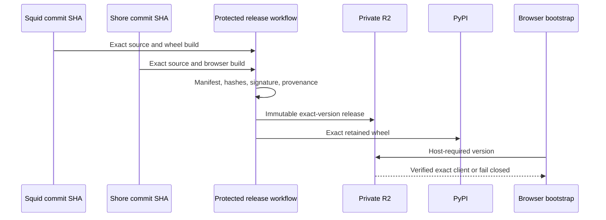
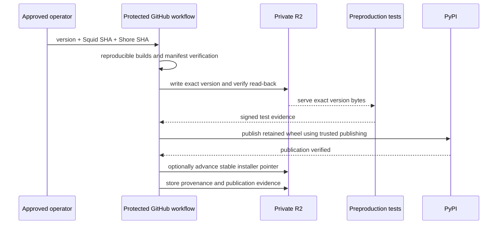

# ADR-0050: Paired AgentSquid and Shore Client Release Distribution

## Context and Problem Statement

ADR-0039 requires every AgentSquid binary to resolve to the exact browser
client built and reviewed with it. The host advertises
`required_client_version`, and Shore already rejects missing or mismatched
versions. That runtime check is insufficient unless the release system also
publishes the binary and browser client as one immutable unit.

AgentSquid and Shore are separate repositories. AgentSquid publishes a Python
wheel, while Shore builds the browser client and operates the Cloudflare
service. An ordinary independent release from each repository creates race and
partial-failure states: a wheel may exist before its client, a client may be
rebuilt from a different commit, or a mutable deployment may silently change
the code delivered for an installed binary.

This ADR decides the artifact store, URL layout, repository handoff, exact
version resolution, development-head behavior, bootstrap boundary, rollback,
revocation, retention, and credential ownership. Mutable operational values and exact commands belong
in the Shore release runbook, not in this decision.

## Decision Drivers

- Bind one exact AgentSquid wheel to one exact Shore browser build.
- Treat release candidates and stable packages as distinct exact versions.
- Make published version directories immutable and independently verifiable.
- Fail closed when a release is missing, malformed, revoked, or mismatched.
- Keep the version-independent bootstrap small and non-command-capable.
- Preserve the previous stable pair for immediate rollback.
- Avoid adding a new public hostname until independent isolation is useful.
- Keep early-stage storage and delivery within Cloudflare's free allowances.
- Give each credential only the minimum repository and infrastructure scope.
- Produce durable provenance and operator evidence for every publication.

## Considered Options

### GitHub Pages version directories

GitHub Pages can host static version directories at no additional charge and is
convenient for a prototype. It has a 1 GB published-site limit, a 100 GB/month
soft bandwidth limit, mutable repository history, and weaker transactional
activation semantics. GitHub also does not position Pages as general SaaS
artifact hosting. Rejected for production release distribution.

### GitHub Releases

GitHub Releases are suitable for human-downloadable build artifacts, but they
do not provide the same-origin URL layout, bootstrap routing, or cache policy
required by the browser. They may remain an optional
mirror, but are not authoritative.

### Cloudflare R2 with a path-scoped Worker

R2 provides private object storage, inexpensive immutable version retention,
S3-compatible CI uploads, and no R2 internet-egress charge. A Worker can expose
only the intended objects at `agentsquid.ai/client/*`, validate manifest and
revocation schemas, apply security headers, and keep GitHub Pages responsible for
the rest of the site. Chosen.

## Decision Outcome

Use a private R2 bucket as the authoritative paired-release store. Serve it
through the existing Cloudflare zone at `https://agentsquid.ai/client/`; a
separate subdomain is not required. The `/client/*` Worker route is operationally
separate from the existing `/@*` Shore route and the GitHub-Pages-hosted site.

The Shore repository owns the protected release workflow because it owns the
service, R2 binding, bootstrap, client build, release-manifest implementation,
and production environment. The workflow checks out exact full commit SHAs from
both repositories. It does not accept branches as release identities and does
not require a cross-repository write token.

### Architecture



### Object layout

Objects use versioned or content-addressed keys:

```text
client/bootstrap.js
client/bootstrap.css
client/dev/manifest.json
client/dev/objects/<name>
client/releases/0.1.6-dev.42/manifest.json
client/releases/0.1.6rc1/manifest.json
client/releases/0.1.6/manifest.json
client/stable.json
client/objects/sha256/<digest>
client/evidence/<version>/provenance.json
client/revocations/<version>.json
```

Release manifests, provenance, revocations, and the optional stable pointer are closed
schemas. A manifest records at least the exact version, Squid commit, Shore
commit, wheel filename/hash/size, every browser artifact hash/size/content type,
build-tool versions, and creation time. The manifest is signed by the protected
release identity. The bootstrap contains or obtains through a separately
reviewed rotation the corresponding public verification key.

`client/releases/<version>/` is write-once. Byte-identical assets may share a
content-addressed object. `stable.json` is an optional mutable installer and
rollback pointer containing `current`, `previous`, a monotonically increasing
generation, and the selected manifest hash. It is never consulted to resolve
the client for an already-running host.

### Resolution modes

There are only two runtime resolution modes:

1. **Exact immutable release.** The host advertises its installed package
   version and the bootstrap fetches exactly
   `/client/releases/<version>/manifest.json`. Thus `0.1.6rc1` resolves to
   `releases/0.1.6rc1`, while `0.1.6` resolves to `releases/0.1.6`. A release
   candidate never follows development head and is not silently promoted into
   the stable version. RC and stable are separate builds because package
   version metadata differs; each receives full verification.
2. **Explicit development head.** Local development uses bundled local assets
   by default. A host deliberately configured for `dev.agentsquid.ai` may use
   the mutable `/client/dev/manifest.json` for cross-device integration tests.
   Production origins and ordinary installed packages must reject this mode.

For reproducible remote development, CI may instead build a unique exact
version such as `0.1.6.dev42+gabc1234` and publish it under `releases/`; this is
preferred whenever test evidence must survive a later head update.

The optional stable pointer selects the recommended version for new installers
and provides an operator rollback target. It never authorizes the bootstrap to
substitute `latest`, a semver-compatible version, or the pointer's current
version for the host-required exact release.

### Release transaction



If any step fails, the optional stable pointer remains unchanged. An exact
version uploaded before a later failure is harmless and may be retried only
with byte-identical inputs. R2 publication and verification precede PyPI, and
PyPI publication precedes changing `stable.json`, so the recommended stable
version never lacks either half of its pair. Because both stores are immutable,
a failure after PyPI publication is recovered by completing pointer activation
or explicitly revoking the release; it is not fixed by rebuilding the same
version.

### Bootstrap and serving boundary

The bootstrap is the only version-independent executable browser asset. It:

1. obtains authenticated routing metadata containing the exact required
   version;
2. fetches that version's immutable manifest and revocation record;
3. verifies schema, version, signature, and referenced content hashes;
4. loads only those exact assets; and
5. otherwise renders a static update/unavailable panel without opening a
   command-capable connection.

Immutable objects receive long-lived immutable caching. Bootstrap, development,
stable-pointer, and revocation responses use revalidation/no-cache semantics appropriate to
their mutability. All responses retain ADR-0039's CSP, MIME-sniffing,
frame-ancestor, referrer, and no-open-redirect protections.

### Rollback, revocation, and retention

Rollback atomically restores `stable.json` to its verified `previous` version.
It does not overwrite either release. A host installed at a newer version
continues requesting that exact version; rollback affects new installations and
operator recommendations, not runtime version matching.

Revocation is a separately signed immutable statement. The bootstrap checks it
before loading client code. A revoked version fails closed even if its original
manifest and objects remain available for audit. Revocation never edits the
original manifest.

Stable and release-candidate versions and their evidence are retained by
default. Mutable development-head objects have bounded retention. Garbage
collection may delete only unreachable
content-addressed objects after a dry run and protected approval.

### Trust and credential boundaries

- Repository `GITHUB_TOKEN` permissions are read-only except for workflow
  evidence explicitly written by the release workflow.
- PyPI publication uses GitHub trusted publishing/OIDC, not a long-lived PyPI
  token.
- The Cloudflare token is scoped to the release bucket and required Worker
  deployment only; it cannot administer unrelated zones or accounts.
- The release manifest signing key is available only to the protected release
  environment with required reviewers. Development head uses a distinct key.
- Runtime Shore credentials cannot upload, replace, list, or delete release
  objects. The release workflow cannot read Shore account or audit data.
- Stable publication requires two-person approval and records actor, inputs,
  hashes, workflow run, and verification results.

## Consequences

### Positive

- Installed binaries deterministically obtain their reviewed browser client.
- Every installed version maps directly to one immutable client manifest.
- Partial failures do not change the recommended stable version.
- Rollback and revocation are explicit, auditable operations.
- The existing domain and Cloudflare account are reused without coupling the
  marketing-site deployment to releases.
- Expected storage and request volume remains within R2's early-stage free
  allowances.

### Negative / risks

- Shore gains a second path-scoped Worker surface and an R2 dependency.
- The release workflow becomes security-critical cross-repository code.
- Bootstrap/signing-key rotation requires exceptional care because a bad
  bootstrap can make all versions unavailable.
- PyPI cannot roll back published bytes; post-publication failures require
  completion or revocation.
- Operational completion still requires provisioned infrastructure, alerting,
  and a witnessed rollback/restore drill; this ADR alone is not evidence that
  those controls exist.

## Implementation and Operations

Implementation remains gated by ADR-0039 Milestone 6.2. Exact environment
variables, secrets, workflow inputs, setup steps, publication commands, evidence,
and incident procedures are maintained in the Shore repository's
`docs/runbooks/shore-release.md`.

## Related Decisions

- ADR-0039 defines Shore remote access, exact-version delivery, and its
  production-readiness gates.
- ADR-0040 defines the independent realtime protocol version. Protocol
  compatibility does not replace exact release matching.
