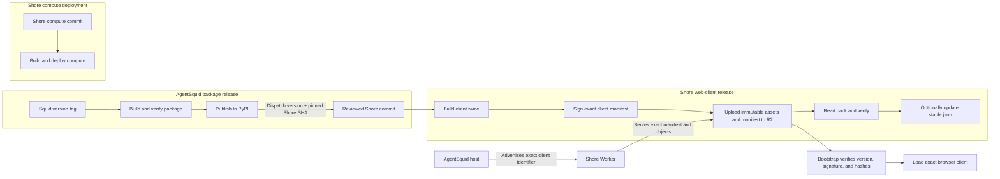

# ADR-0050: Independent Shore Web-Client Distribution

## Context

AgentSquid remote access requires a host to select an exact browser client.
Earlier drafts coupled that client to the AgentSquid wheel in one publisher.
That unnecessarily made Shore responsible for building and publishing
AgentSquid and confused remote-access delivery with Shore compute deployment.

The security requirement is narrower: the browser must load exactly the signed,
immutable client release advertised by the authenticated host and fail closed
if it cannot verify that release. It does not require the wheel and client to
share a manifest, repository, publisher, or credentials.

## Decision

AgentSquid packages and Shore remote-access clients use coordinated release
paths with independent publishers; Shore compute remains separate:

- Squid owns its tag-driven PyPI publication and dispatches the matching client
  release only after PyPI succeeds.
- Shore owns browser-client builds and publication to a private R2 bucket.
- Shore compute has separate build and deployment workflows.

No release workflow checks out both repositories or publishes both a Python
package and Shore assets. Publishing a web client does not deploy the Shore
Worker or compute services.

An AgentSquid host advertises the exact web-client identifier it requires. The
relay validates the identifier's format and stores it but does not compare it
with a Worker-compiled client constant. The authenticated browser route returns
that identifier. The stable bootstrap fetches only
`/client/releases/<version>/manifest.json`, verifies its version, signature,
revocation state, and content hashes, and then loads its assets. Failure renders
a static non-command-capable panel.

Client identifiers use the project's accepted PEP 440 subset. The coordinated
default release uses the AgentSquid package version; compatibility is approved
when the Squid release pins the reviewed Shore source commit. AgentSquid permits
an exceptional independently published client to be selected with
`AGENTSQUID_SHORE_CLIENT_VERSION`.

### Independent deployment and client resolution



The package release coordinates the client lane, but each publisher retains its
own repository, credentials, build, and failure boundary. Runtime resolution
reads already-published R2 artifacts; it does not trigger package, Worker, or
compute deployment.

## Storage and serving

The authoritative store is a private R2 bucket exposed through the reviewed
`https://agentsquid.ai/client/*` Worker route:

```text
client/bootstrap.js
client/bootstrap.css
client/dev/manifest.json
client/dev/objects/<name>
client/releases/<exact-version>/manifest.json
client/objects/sha256/<digest>
client/evidence/<exact-version>/provenance.json
client/revocations/<exact-version>.json
client/stable.json
```

A client manifest is a closed signed document containing its schema, exact
version, revocation state, and browser asset names, sizes, and SHA-256 hashes.
It contains no AgentSquid wheel. Exact manifests, evidence, revocations, and
content-addressed objects are immutable. Byte-identical assets may be shared.

`stable.json` is an optional recommendation for operators and installers. It is
never consulted to resolve a running host's exact client. Mutable development
head is available only in preproduction; reproducible development evidence uses
a unique exact identifier such as `0.1.6.dev42+gabc1234`.

## Publication

The protected Shore workflow accepts an exact client version and Shore commit
SHA, builds browser assets twice, compares them, creates and signs the manifest,
uploads assets before the manifest, and verifies the published bytes. It may
then advance the optional recommended-client pointer. It has no PyPI identity,
Squid checkout, Python build, or compute deployment authority.

The protected Squid workflow independently builds, checks, and publishes the
AgentSquid package to PyPI, then dispatches Shore with the same version and its
committed Shore source pin. Prereleases target preproduction; stable and
post-releases target production and advance the recommendation. A dispatch or
client-publication failure marks the overall release incomplete but does not
mutate or overwrite either immutable surface; retry is safe for identical bytes.

## Trust boundaries

- The client signing key is available only to the protected Shore release
  environment; development uses a distinct key.
- The release workflow can write client-release R2 objects but cannot access
  Shore accounts, relay state, audits, or compute deployment credentials.
- The runtime Worker can read but cannot publish or delete release objects.
- Squid's PyPI trusted-publishing identity remains in the Squid repository and
  is not granted to Shore.
- Bootstrap signing-key rotation is reviewed independently from individual
  client releases.

## Rollback, revocation, and retention

Rollback changes only `stable.json`; running hosts continue requesting their
advertised exact client. Revocation is a separately signed immutable statement
and never alters the original release. Retained manifests and reachable objects
remain available for every supported exact client.

## Consequences

Positive:

- AgentSquid and its required Shore client are launched together while retaining
  separate publishers and credentials; Shore compute can ship independently.
- The Worker no longer requires redeployment for a new client version.
- Repository credentials and failure domains remain narrow.
- Exact signed client selection and fail-closed behavior are preserved.

Risks:

- PyPI succeeds before client dispatch, so a client-workflow failure temporarily
  leaves a published package whose remote client fails closed until retry.
- The bootstrap and signing-key rotation remain security-critical.

Operational commands, approvals, evidence, retention, and incident procedures
are maintained in Shore's `docs/runbooks/shore-release.md`.

## Related decisions

- ADR-0039 defines Shore remote access and exact-client selection.
- ADR-0040 versions the realtime application protocol independently.
- ADR-0034 owns AgentSquid's PyPI distribution.
